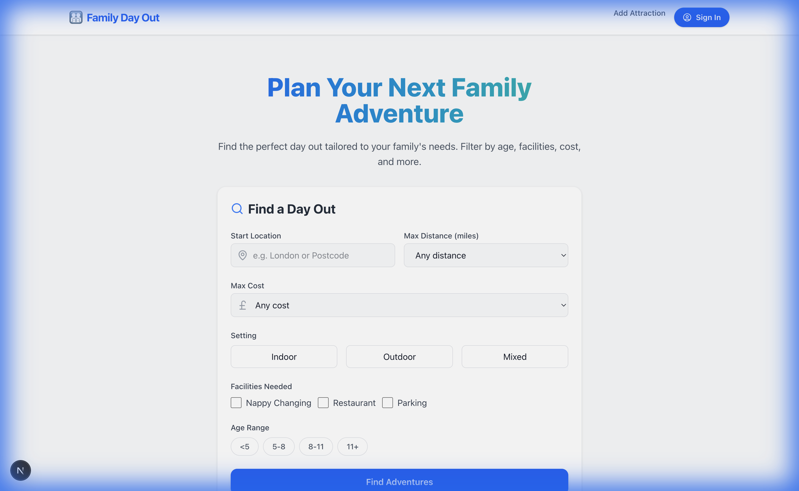
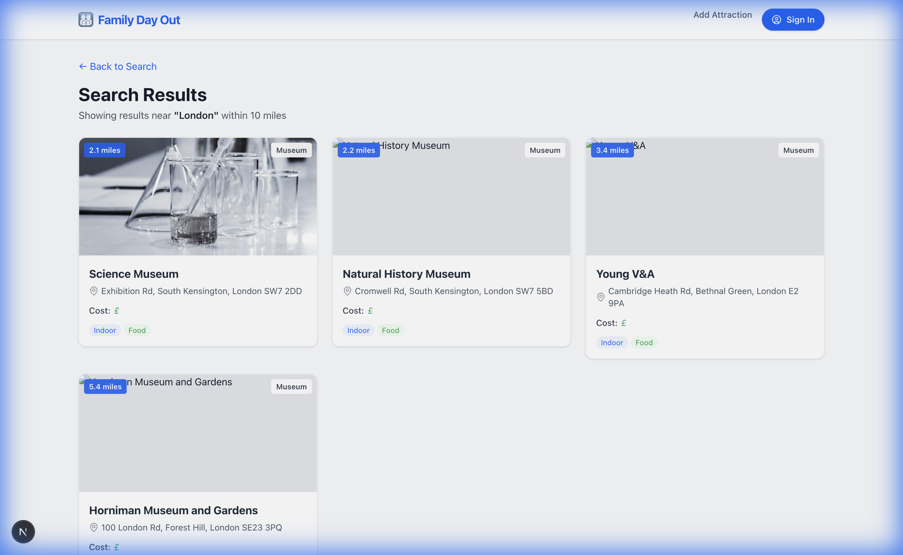
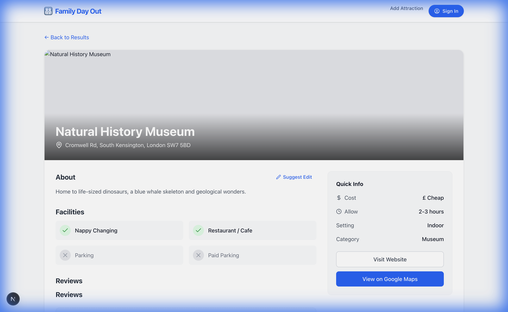
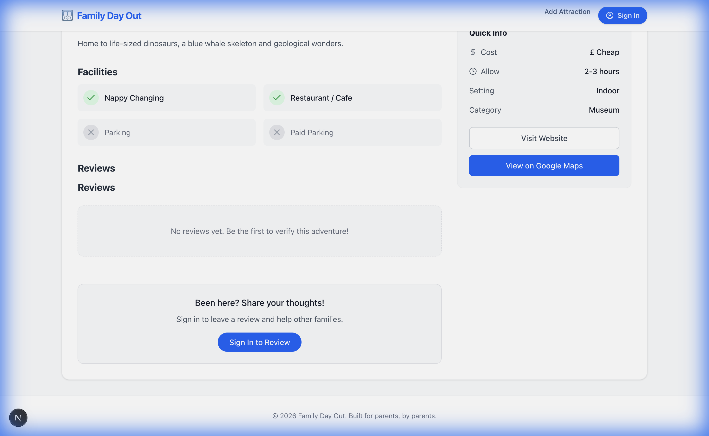
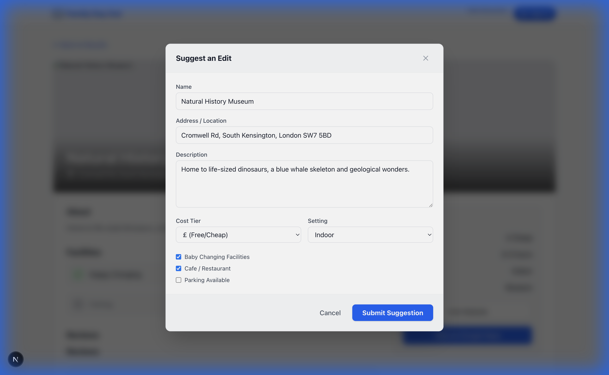

# Family Day Out - User Guide

Welcome to the **Family Day Out App**! This guide will help you find the perfect adventure for your family, leave reviews, and even suggest improvements.

## 1. Finding an Adventure
The home page allows you to search for attractions based on your location, budget, and preferences.

### Search by Location
1.  Enter your **Start Location** (e.g., "London" or a Postcode).
2.  Select a **Max Distance** (e.g., "20 miles") to see only nearby results.
3.  Click **"Find Adventures"**.

You can also filter by:
*   **Cost**: From £ (Cheap) to ££££ (Splash out).
*   **Setting**: Indoor, Outdoor, or Mixed (great for rainy days!).
*   **Facilities**: Need nappy changing or a cafe? Check the boxes.

### Search Results
The results page shows attractions sorted by distance from your location (if provided).

*   **Distance Badge**: Shows exactly how far away each location is.
*   **Quick Info**: See the cost, rating, and category at a glance.
*   **Click a Card** to view full details.

## 2. Viewing Attraction Details
Once you select an adventure, you'll see all the important information.

*   **Photos & Map**: See what it looks like and where it is.
*   **Address**: Click "View on Google Maps" for directions.
*   **Facilities**: Instantly see if they have parking, food, etc.

## 3. Reading & Writing Reviews
Scroll down to see what other families think.

*   **Read Reviews**: See star ratings and comments from the community.
*   **Write a Review**: select a star rating and share your experience to help others! (You may need to sign in first).

## 4. Contributing (Suggest Edits)
Spot a mistake? Price changed? You can help keep the guide accurate!

1.  Click the **"Suggest Edit"** button (pencil icon) near the top of the page.
2.  Update the information in the form (e.g., change " Outdoor" to "Mixed").
3.  Click **Submit Suggestion**.

An admin will review your suggestion and approve it shortly.

## 5. Admin Dashboard (For Editors)
If you have Editor or Admin access, you will see a **"Dashboard"** link in the header.
*   Go to **Dashboard** to Approve or Reject user suggestions.
